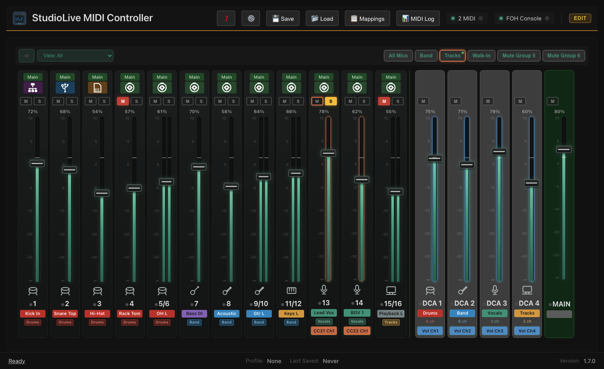
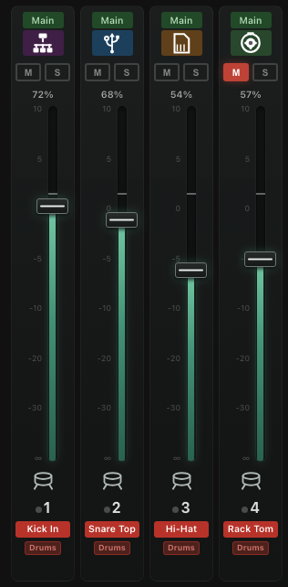
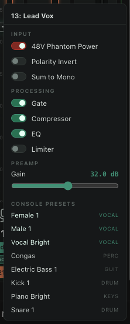
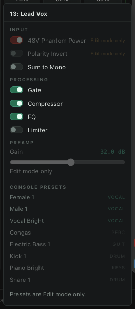
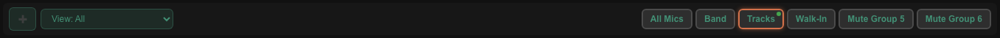
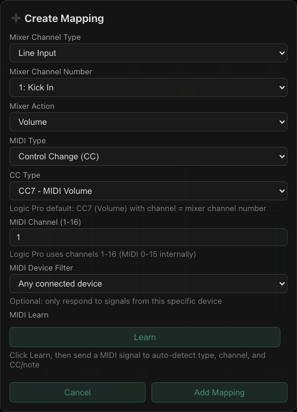
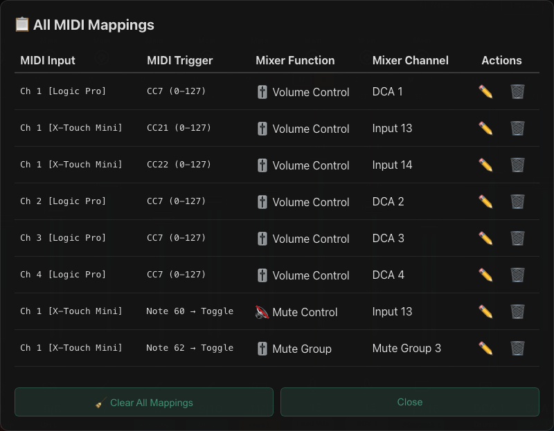
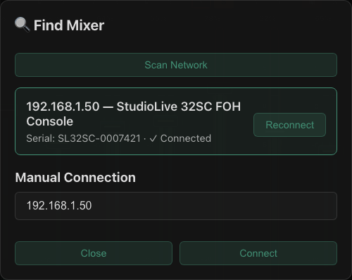
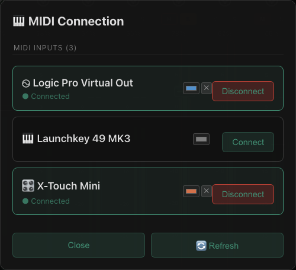

# StudioLive MIDI Controller

MIDI control for Fender(PreSonus) StudioLive III mixers. Map DAW faders and automation to your mixer's physical faders over the network — built on [presonus-studiolive-api](https://github.com/featherbear/presonus-studiolive-api) by Andrew Wong; and builds on the ideas in https://github.com/featherbear/presonus-studiolive-api-midi-integration.git to provide a visual interface for mapping and monitoring. This tool is not meant as a replacment for Universal Connect, but more an adjunct to it to allow users to control the mixer from their DAW, control surfaces, or other MIDI controllers.  




## Features

- **MIDI ↔ Mixer control** — CC, Note, and Note-Value modes with real-time feedback
- **Visual fader interface** — drag faders, mute, solo, with change-source color coding
- **All channel types** — LINE, AUX, FX, SUB, MAIN, DCA, mute groups
- **Edit & Run modes** — lock the interface for performance; MIDI transport control for your DAW
- **Multi-touch via TUIO** — drive several faders at once from a tablet (TouchOSC, Lemur)
- **Stereo linking** — automatic detection and paired fader display
- **Auto-discovery** — UDP broadcast plus an active TCP subnet sweep, so mixers are found even when Universal Control is holding the discovery port
- **Per-mixer presets** — presets remember which mixer they were built for and offer a fresh start when you connect to a different one
- **Persistent reconnection** — automatically reconnects to configured MIDI and mixer
- **Profile management** — save/load complete configurations
- **Filter modes** — view all, mapped only, DCA groups, or custom groups
- **Fader stacking** — wrap more than 16 channels into two compact rows
- **Level metering** — per-channel indicator or live VU meter with peak hold
- **Channel labels, colors & icons** — set based on mixer configuration, with per-DCA color coding
- **Channel settings menu** — phantom power, polarity, mono, gate/compressor/EQ/limiter in-out, and preamp gain in dB, straight from the fader; the destructive ones are locked in Run mode
- **Console channel presets** — recall the mixer's own preset library, with the ones matching each channel's instrument listed first

## A Look Around

Every channel is a full strip: the instrument icon and color come straight from the
console, the meter shows live level with peak hold, and the badges underneath name the
channel, its DCA group, and any MIDI control bound to it.



Clicking a channel's instrument icon opens its settings — phantom power, polarity,
mono, the four processor in/out switches, and preamp gain in dB, all read live from
the console. Below them sits the mixer's own channel preset library, with the presets
matching that channel's instrument listed first.

Phantom power, polarity, gain and preset recall are all locked while the interface is
in Run mode. Enabling 48V asks first, because it can damage a ribbon microphone; so
does recalling a preset, because it replaces the whole strip.

 

Mute groups sit along the top of the fader area — a lit ring means the group is
currently muting its members.



Mappings are built in a dialog that can either be filled in by hand or taught: press
**Learn**, move the fader or press the pad on your controller, and the MIDI type,
channel, and CC/note are captured for you.



Everything you have bound is listed in one place with its source device on every row,
so it is obvious what is driving what.



Mixers are found automatically by UDP broadcast plus an active TCP sweep of the local
subnet, so the console still shows up when Universal Control is holding the discovery
port. Connected MIDI devices each get their own color, which is then used to tint the
mappings they own.

 

## Quick Start

```bash
git clone https://github.com/sandinak/studiolive-midi-controller.git
cd studiolive-midi-controller
make setup && npm run build && npm start
```

`presonus-studiolive-api` is a pinned git dependency that builds itself on install —
no sibling checkout needed. (`make link-local` still exists for working against a
local checkout of it.)

Requires **Node 22+**, **Python 3.11**, and **yarn** (`corepack enable`) to build from
source — see [Setup](docs/setup.md) for why. Linux needs `libasound2` at runtime;
MIDI there goes through ALSA.

Or download a build from [Releases](https://github.com/sandinak/studiolive-midi-controller/releases):
a **DMG** for macOS, an **installer or portable .exe** for Windows, and an
**AppImage, .deb, or tarball** for Linux (x64 and arm64).

## Documentation

| Guide | Description |
|-------|-------------|
| [Setup](docs/setup.md) | Prerequisites, installation, building, first launch, Logic Pro configuration |
| [Usage](docs/usage.md) | Fader controls, mappings, visual indicators, troubleshooting |
| [Logic Environment Reference](docs/LOGIC_ENVIRONMENT_QUICK_REFERENCE.md) | Detailed Logic Pro MIDI Environment settings |
| [Building](docs/building.md) | Creating distributable DMG and Windows packages |
| [Changelog](CHANGELOG.md) | Release history |

## Acknowledgments

Built on the excellent [presonus-studiolive-api](https://github.com/featherbear/presonus-studiolive-api) by Andrew Wong (featherbear).

## Disclaimer

Not affiliated with or endorsed by PreSonus or Fender. StudioLive is a trademark of PreSonus.

## License

MIT — see [LICENSE](LICENSE) for details.

## Contributing

Contributions welcome — please open a Pull Request or issue on [GitHub](https://github.com/sandinak/studiolive-midi-controller).

```bash
npm run typecheck      # TypeScript, no emit
npm test               # Jest unit suite
npm run test:coverage  # ...with coverage thresholds enforced
```

CI runs the type check and the coverage-gated test suite on every push and pull request,
plus a headless UI pass that boots the real renderer against a synthetic mixer and
re-captures every screenshot in this README — so a change that breaks the interface
fails the build instead of quietly shipping. Regenerate them locally with:

```bash
make shots             # all scenes → docs/images/
npm run shots -- main-window   # or just one
```

No mixer, MIDI interface, or network is involved; see [tools/screenshot/](tools/screenshot/).
 The integration suite under `tests/integration/` talks to real hardware and skips itself unless `MIXER_IP` is set:

```bash
MIXER_IP=192.168.1.50 npx jest -c jest.integration.config.js
```
