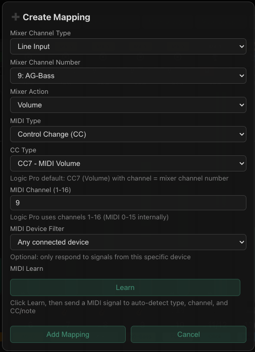

# Logic Pro — StudioLive MIDI Controller Setup

Logic Pro exposes a built-in virtual MIDI port called **Logic Pro Virtual Out**
that is visible to all CoreMIDI applications on the same Mac — no IAC Driver or
extra setup required.  The StudioLive MIDI Controller app connects to it like any
other MIDI device.

```
Logic Pro tracks  ──(CC automation)──>  Logic Pro Virtual Out  ──>  StudioLive MIDI Controller  ──>  Mixer
```

If you have a **hardware MIDI controller** (BCF2000, X-Touch Mini, etc.) you can
use it instead — the app works with any CoreMIDI source.

---

## Step 1 — Configure Logic Pro tracks

For each mixer channel you want to control, set its **MIDI output** to
*Logic Pro Virtual Out* so that track automation flows to the app.

### Option A — External MIDI track (simplest)

1. In Logic, add an **External MIDI** track (`Track → New External MIDI Track`).
2. In the track's **Inspector**, set:

   | Setting | Value |
   |---|---|
   | **MIDI Out port** | Logic Pro Virtual Out |
   | **MIDI Channel** | Unique channel per mixer channel (e.g. 1–16) |

3. Draw **CC 7 (Volume)** automation on the track, or record fader moves during
   playback.
4. Repeat for each mixer channel, incrementing the MIDI channel each time.


<!-- Screenshot: docs/images/logic-track-inspector.png -->

### Option B — MIDI Environment faders (advanced, more control)

Use this if you want a dedicated visual fader panel inside Logic, or need to map
controls beyond CC 7.

1. Open MIDI Environment: hold **Option** + click **Window → Open MIDI
   Environment**.
2. Create a new layer named *StudioLive Mixer*.
3. Add a **Physical Output** object; set its port to **Logic Pro Virtual Out**.
4. For each mixer channel, add a **Fader** object and configure it:

   | Setting | Value |
   |---|---|
   | Object Type | Fader |
   | Style | Vertical |
   | MIDI Message | Control Change |
   | Channel | Unique channel per mixer channel (1–16) |
   | Controller | 7 (Volume) |
   | Min / Max | 0 / 127 |

5. Cable each fader to the Physical Output.
6. (Optional) Add **Button** objects on a separate CC for mute / solo.


<!-- Screenshot: docs/images/logic-environment.png -->

#### Cable diagram

```
Fader Ch 1 (CC 7, ch 1) ──┐
Fader Ch 2 (CC 7, ch 2) ──┤
Fader Ch 3 (CC 7, ch 3) ──┼──> Physical Output (Logic Pro Virtual Out)
Mute  Ch 1 (CC 1, ch 1) ──┤
Mute  Ch 2 (CC 1, ch 2) ──┘
```

#### Layout suggestion

```
┌──────────────────────────────────────────────────────┐
│  StudioLive Mixer                                    │
├──────────────────────────────────────────────────────┤
│  [Fdr] [Fdr] [Fdr] [Fdr] [Fdr] [Fdr] [Fdr] [Fdr]  │
│   ch1   ch2   ch3   ch4   ch5   ch6   ch7   ch8    │
│  [ M ] [ M ] [ M ] [ M ] [ M ] [ M ] [ M ] [ M ]  │
│                                                      │
│  [Physical Output — Logic Pro Virtual Out]           │
└──────────────────────────────────────────────────────┘
```

---

## Step 2 — Connect the app to Logic Pro Virtual Out

1. Launch **StudioLive MIDI Controller** and connect to your mixer.
2. Click the **MIDI status dot** in the header bar to open the MIDI panel.
3. Select **Logic Pro Virtual Out** from the device list and click **Connect**.


<!-- Screenshot: docs/images/app-midi-connect.png  (see also: midi-modal.png) -->

---

## Step 3 — Add mappings in the app

Mappings tell the app which incoming MIDI message controls which mixer channel.
**The MIDI channel and CC numbers must match what Logic is sending.**

### Using MIDI Learn (fastest)

1. Right-click any fader in the app → **Learn MIDI mapping**.
2. Press Play in Logic and move the corresponding fader.  The CC and channel are
   detected automatically.
3. Click **Save**.

### Manual mapping

1. Right-click a fader → **Edit Mapping** (or click **Mappings** in the toolbar).
2. Set:

   | Field | Value |
   |---|---|
   | **Action** | Volume |
   | **MIDI Type** | CC |
   | **CC Number** | 7 (or whatever CC you chose in Logic) |
   | **MIDI Channel** | Must match the Logic track's MIDI channel |

3. Click **Save Mapping**.



---

## Quick-setup checklist

- [ ] Logic tracks (or Environment faders) set to output to **Logic Pro Virtual Out**
- [ ] Each track/fader uses a **unique MIDI channel** (1–16)
- [ ] App connected to **Logic Pro Virtual Out**
- [ ] One mapping in the app per mixer channel, with matching MIDI channel
- [ ] Test: move a Logic fader → app fader moves → physical mixer fader moves

---

## Testing

1. Press **Play** in Logic and move a fader (or let automation play).
2. Watch the StudioLive MIDI Controller app:
   - **MIDI activity dot** in the header should flash.
   - The corresponding on-screen fader should move.
3. Check your physical mixer — the fader should move in real time.

---

## Troubleshooting

**MIDI activity dot does not flash**
- Confirm the app is connected to *Logic Pro Virtual Out* (MIDI panel).
- Confirm the Logic track's **MIDI Out** is set to *Logic Pro Virtual Out*
  (track Inspector).
- Make sure Logic is in **Play** mode — automation CC is only sent during playback.

**Fader moves in app but not on the mixer**
- Verify the app is connected to the mixer (mixer status dot is green).
- Confirm a volume mapping exists for that channel with the correct MIDI channel.

**Wrong channel moves on the mixer**
- The MIDI channel in the Logic track Inspector must match the MIDI channel in the
  app mapping — these are independent of the mixer channel number.

**Logic track not sending MIDI CC**
- Make sure CC 7 automation is drawn on the track (or the track is
  record-enabled for real-time fader moves).
- Logic only sends MIDI out during **playback** for automation lanes — press Play.

---

## Saving your setup

- **Logic**: Save the project (or *File → Save as Template*) to preserve track and
  Environment configuration.
- **App**: Save a preset (`💾 Save`) — it stores the MIDI device name and all
  mappings, so they reload automatically on the next launch.
