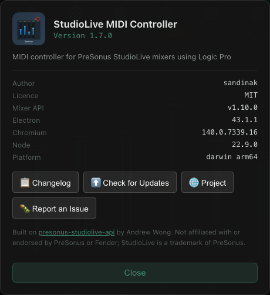
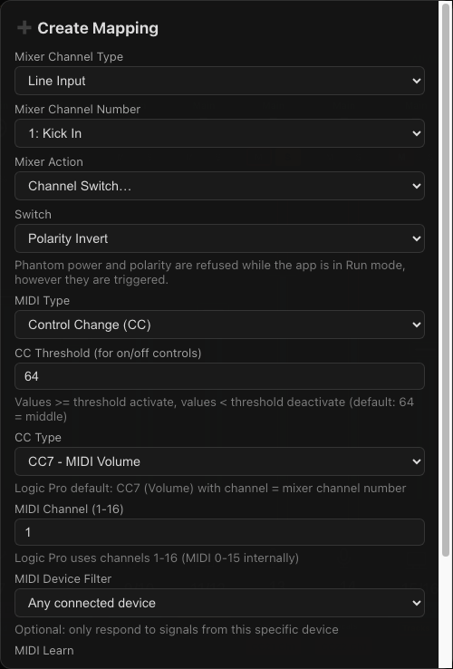

# Usage Guide

## Edit & Run Mode

The app has two modes, toggled with the **EDIT** / **RUN** button at the far right of the header.

| Mode | Accent bar | Behaviour |
|------|-----------|-----------|
| **Edit** | Orange | Full configuration — create, edit and delete mappings; right-click menus available |
| **Run** | Green | Interface locked against accidental edits. Faders and MIDI still work; the transport button appears |

Enable **Start in Run Mode** in **⚙️ Preferences** to launch straight into Run mode — useful for a dedicated performance machine.

### Transport Control

The **▶ Play** / **⏸ Stop** button, visible in Run mode, sends MIDI Start and Stop messages to every connected MIDI output. Logic Pro, Ableton and other DAWs that follow MIDI transport will respond.

## Fader Controls

| Action | Description |
|--------|-------------|
| **Drag fader** | Adjust mixer volume (sends MIDI feedback to the DAW) |
| **Click M** | Toggle mute |
| **Click S** | Toggle solo (yellow when active) |
| **Double-click fader** | Edit or create mapping (Edit mode) |
| **Right-click fader** | Context menu: Learn, Edit, Clear, or Delete (Edit mode) |
| **Ctrl/Cmd + Click** | Select multiple faders |

## Keyboard Shortcuts

| Shortcut | Action |
|----------|--------|
| **Cmd-S** / **Ctrl-S** | Quick-save to current preset path (opens Save dialog if no path set) |

## Managing Mappings

**Create:** Double-click any fader → set MIDI Type, CC Type, Logic Channel → Save

**Edit:** Double-click a mapped fader → modify settings → Save

**Clear:** Right-click → 🧹 Clear Channel (removes MIDI mapping, keeps channel visible)

**Delete:** Right-click → 🗑️ Delete (removes channel from view entirely)

**View All:** Click **📋 Mappings** in the toolbar to open a table of every mapping with Edit and Delete actions.

## MIDI Modes

| Mode | Description |
|------|-------------|
| **CC** | Standard MIDI Control Change (CC7, CC10, CC11, CC102–104) |
| **Note** | Note on/off for triggering actions |
| **Note-Value** | Note velocity as fader value (C1–C4 range) |
| **None** | Channel visible without MIDI mapping |

## Toolbar

- **➕ Add Channel** — Create new channel mapping
- **➖ Remove Selected** — Remove selected channel mappings
- **🗑️ Clear All** — Clear all MIDI mappings (channels remain visible)
- **🔍 Filter** — Choose which channels are shown (see below)
- **1–8** — Mute group toggles
- **📋 Mappings** — View, edit, or delete all mappings in a list
- **💾 Save** / **📂 Load** — Preset management
- **⚙️ Preferences** — Display and behaviour settings
- **📊 MIDI Log** — Live MIDI event monitor
- **▶ Play / ⏸ Stop** — DAW transport (Run mode)

## Filter Modes

The filter dropdown supports several views:
- **All** — All LINE channels plus any non-LINE mapped channels
- **Mapped** — Only channels with MIDI mappings
- **DCA groups** — Channels assigned to a specific DCA
- **Auto-filter groups** — Icon-based channel groupings from the mixer (~Drums, ~Guitars, …)
- **Device** — Only channels mapped to a specific MIDI device

## Fader Stacking

When more than 16 channels are in view, enable **Fader Stacking** to wrap them into two shorter rows rather than one long scrolling strip. Row breaks fall on channel boundaries — 1–16 above, 17–32 below. The setting is stored in the preset.

## Multiple MIDI Devices

Multiple MIDI devices can be connected and used simultaneously. Each device maintains its own mappings, allowing different physical controllers to control different channels.

**MIDI Learn:** Press **Learn** in the mapping dialog and move any control on any connected device — the app will automatically detect the device, MIDI channel, and CC/note number.

## MIDI Device Colors

Each MIDI device can be assigned a color:

1. Open the **MIDI** connection panel
2. Click the color swatch next to a device name
3. Choose a color

Mapped faders display a small colored dot badge for the device that controls them. If a mapped device disconnects, the fader border switches to a pulsing dashed red/white animation until the device reconnects.

## DCA Colors

Each of the 8 DCA groups can be given a color of its own — right-click a DCA fader's label to choose one. LINE channels belonging to that DCA carry a small badge in the same color, making group membership visible at a glance.

DCA colors are saved per preset rather than globally, because they describe one particular mixer's group layout.

## Channel Level Display

Configurable in **⚙️ Preferences → Channel Level Display**:

| Mode | Description |
|------|-------------|
| **None** | No level indicator (default) |
| **Indicator** | Colored dot inside the channel number — green/yellow/red based on signal level |
| **Meter** | Vertical VU bar alongside the fader showing real audio levels from the mixer |

When **Meter** mode is active, enable **Peak Hold** to show a white line at the peak level for 3 seconds before it drops.

Meter data comes from the mixer's UDP audio stream, so it reflects actual pre-fader signal levels.

## Input Source

LINE, FX and FX Return channels show a badge for their current input source — **Analog**, **Network**, **USB** or **SD Card**. Right-click the badge to switch sources; the change is sent directly to the mixer.

## About Dialog

Click the **app icon** in the top-left of the header for version, author, licence,
the pinned mixer-API tag, and the Electron/Chromium/Node versions — the details
worth quoting in a bug report. It also links to the changelog, an update check,
and the issue tracker.



## Channel Settings Menu

Click a channel's **instrument icon** to open its settings. A channel the console
has no icon for shows a dimmed **⋮** in its place, which opens the same menu. The switches read live
from the mixer and are written straight back to it.

| Switch | Group | Notes |
|--------|-------|-------|
| **48V Phantom Power** | Input | Confirms before switching on. Edit mode only. |
| **Polarity Invert** | Input | Edit mode only. |
| **Sum to Mono** | Input | |
| **Gate** | Processing | |
| **Compressor** | Processing | |
| **EQ** | Processing | |
| **Limiter** | Processing | |
| **Preamp Gain** | Preamp | Slider in dB. Edit mode only. |
| **Console Presets** | — | Recalls the whole strip. Confirms first. Edit mode only. |


### Preamp Gain

The **Gain** slider is in decibels, using the range the console publishes for
itself (0–60 dB on a StudioLive III) rather than a hard-coded one, so it stays
correct across models. The value is written when you release the slider, not on
every movement, so dragging does not flood the console with packets.

Gain is **Edit mode only**. It is a setup control — you ride the fader, not the
preamp — and it is the one change in this menu that can produce feedback.

### Console Channel Presets

The bottom of the menu lists the channel presets stored on the console — the
factory library is 51 presets across Drum, Guit, Vocal, Keys, Perc, Brass and
Wind. Presets whose category matches the channel's instrument icon are listed
first and shown in green; the rest follow alphabetically. The match only
reorders the list, so every preset stays reachable whatever a channel's icon
says, and a channel with no icon simply gets the full list alphabetically.

Recalling a preset **replaces the entire channel strip** — gain, EQ, compressor,
gate and limiter — so it always confirms first, and it cannot be undone from the
app. Presets are Edit mode only.

> The instrument match reads the channel's icon id, which the console publishes
> as a free-form string with no fixed vocabulary — both `keyboards/piano` and a
> bare `piano` occur. Matching is therefore on instrument keywords rather than
> the path prefix.

### Why some switches lock in Run mode

Phantom power and polarity are held back while the interface is locked, and shown
greyed with an *Edit mode only* note:


Phantom power can damage ribbon microphones, and an accidental polarity flip on a
summed source is a silent, hard-to-trace way to gut the low end mid-set. The
processor switches stay available, because dropping a gate or bypassing a
compressor during a performance is a normal thing to want and is instantly
reversible.

Switching on 48V asks for confirmation even in Edit mode. Turning it *off* never
does — that is the safe direction and should not be slowed down.

The lock is enforced in the main process, not just by greying out the control, so
a stale window or a stray IPC message cannot flip phantom power during a show.

A switch the mixer has not reported shows as **unavailable** rather than as *off*,
so an unknown state is never mistaken for a known one.

## Mapping Switches and Gain to MIDI

Everything in the channel settings menu can also be driven from a controller.
In the mapping dialog, **Mixer Action** offers:

| Action | Control type | Notes |
|--------|--------------|-------|
| **Preamp Gain (dB)** | Continuous (CC or note-value) | Scales across the console's gain range, 0–60 dB by default |
| **Channel Switch…** | On/off | A second dropdown picks which switch |



Switch mappings behave like mute and solo: a CC crossing the threshold, or a
note on/off, turns the switch on or off, and **Invert** flips the sense.

> **Narrow the gain range.** A gain mapping defaults to the full 0–60 dB, so a
> controller sweep reaches +60 dB at the top of its travel. Setting a range like
> 10–40 dB keeps the whole fader useful and puts a ceiling on what a stray move
> can do.

The Run-mode locks apply here too, and are enforced in the main process: a
controller sending the wrong note **cannot** flip phantom power or polarity, or
change gain, while the app is in Run mode. It is the same interlock that greys
those controls out in the channel menu, not a separate check that could drift.

## Visual Indicators

### Change Source Glow
- **Green glow** — Change from MIDI (DAW)
- **Blue glow** — Change from API (mixer / Universal Control)
- **Purple glow** — Change from UI (dragging fader in app)

### Fader Markers
- **Orange line** — Current MIDI value position
- **White line at 75%** — 0 dB reference

### Badges
- **M badge (blue)** — Channel assigned to Main mix
- **LINE/NET/USB/SD badge** — Input source type
- **Colored dot** — MIDI device color badge (when device color is assigned)
- **DCA badge** — DCA group membership, in that group's color

### Connection Status Buttons
- **Solid color** — Connected
- **Striped red/black** — Disconnected (but was previously configured) — reconnect is active

### Status Indicators
- **Orange dot** (top-right) — Unsaved changes
- **Green dot** (sidebar) — Connected
- **Red dot** (sidebar) — Disconnected

## Stereo Channels

Stereo-linked channels are displayed as dual L/R faders:
- Channel number shows as "11/12" format
- Two narrow faders side-by-side
- Both faders move together

Stereo linking is configured on the mixer itself (in Universal Control). The app detects and displays links automatically.

## Mute Groups

The mixer's 8 mute groups are toggled from the numbered buttons in the faders toolbar. A red highlight means the group is active (its channels are muted); a green dot means the button has a MIDI mapping.

Group membership is configured on the mixer. Changes made elsewhere — the console's own buttons, or Universal Control — are reflected here as they happen.

To map a controller button to a group, right-click it and choose **Learn Mute Group Mapping**, or select **Mute Group** as the action in the Add Mapping form.

## Touch Control (TUIO)

The app listens for **TUIO** multi-touch messages on **UDP port 3333**, so a tablet can drive several faders simultaneously — something a mouse cannot do. TouchOSC and Lemur both work, as does any app with TUIO output.

Point the sender at your computer's IP address on port 3333. Nothing needs configuring in the app; the listener runs from startup.

Touches map onto the fader strip directly:
- **Horizontal position** selects the fader — the surface is divided evenly across the currently visible faders, so the filter setting changes what your touches reach
- **Vertical position** sets the level — top is full, bottom is silence
- Each finger stays with the fader it first touched, so sliding sideways won't jump to a neighbour

If nothing happens, check that UDP 3333 isn't firewalled and that no other app is holding the port — it's a common default. On a conflict the app logs a warning at startup and runs without touch support.

## Profiles

Profiles are saved as JSON in:

```
macOS:    ~/Library/Application Support/StudioLive Midi Controller/
Windows:  %APPDATA%\StudioLive MIDI Controller\
```

Each profile stores:
- Mixer identity — IP address, model, device name and serial number
- MIDI device names and preferred devices list
- MIDI device color assignments
- DCA group colors
- Channel level display preference and peak hold
- Fader stacking and fader filter state
- All channel mappings
- MIDI feedback enabled/disabled

Use **💾 Save** / **📂 Load** in the toolbar, or **Cmd-S** for quick-save.

A profile named `default.json` is loaded automatically at startup.

### Working With More Than One Mixer

A profile remembers which mixer it was built for — by serial number where the mixer reports one, otherwise by model and IP address. Connect to a mixer that doesn't match and the app says so, offering to start a fresh profile for it.

Creating one clears the mappings and DCA colors, which belong to the mixer, while keeping your MIDI devices, device colors and display preferences, which belong to your setup. **The previous profile file is left untouched**, so you can load it again when you reconnect to the original mixer.

This matters because channel layouts differ between models — a 32-channel profile applied to a 16-channel mixer would map faders onto channels that don't exist.

## Preferences

Click **⚙️ Preferences** to configure:
- **Fader Smoothing** — Transition speed (0–500 ms, default 300 ms)
- **Channel Level Display** — None / Indicator / Meter
- **Peak Hold** — Hold peak marker for 3 seconds (Meter mode only)
- **Fader Stacking** — Wrap more than 16 channels into two rows
- **Start in Run Mode** — Launch directly into Run mode

## MIDI Log

Click **📊 MIDI Log** to monitor real-time MIDI events:
- **Green** — Note On
- **Red** — Note Off
- **Blue** — Control Change

## Auto-Reconnection

The app automatically retries connections to your configured MIDI devices (every 3 s) and mixer (every 3 s). When a device disconnects unexpectedly, the corresponding connection button switches to a striped red/black background immediately, and reconnection is attempted automatically. Status is shown in the sidebar and logged on each connect/disconnect.

When manually disconnecting a MIDI device that has active mappings, you will be prompted to clear those mappings.

## Troubleshooting

### Mixer Not Found

- Ensure the mixer is on the same network / subnet
- Allow **TCP port 53000** (mixer control) and **UDP port 47809** (discovery broadcasts) through your firewall
- Enter the mixer IP manually — a typed-in address is probed directly and doesn't depend on discovery

If **PreSonus Universal Control** is running it holds UDP 47809 and the app can't receive discovery broadcasts. To work around this the app also TCP-probes every address on your local subnets, so the mixer should still appear — it may just take a few seconds longer. Subnets wider than /22 are skipped to keep the sweep bounded.

### MIDI Not Working
- Verify MIDI connection status (green dot in sidebar)
- Confirm MIDI channels match between DAW and mapping
- Check the **MIDI Log** for incoming messages
- Restart your DAW if needed

### Faders Not Moving (DAW → Mixer)
- Verify both mixer and MIDI are connected (green dots)
- Check mapping: MIDI Type should be CC, channel must match
- Ensure DAW MIDI output is set to the correct virtual port

### Faders Not Moving (App → Mixer)
- Verify mixer connection
- Check channel type and number match the mixer

### Automation Not Working
- Press **A** in Logic Pro to enable Automation
- Verify automation mode is Touch, Latch, or Write (not Read)

### Jerky Fader Movement
- Increase fader smoothing in Preferences (try 400–500 ms)
- Use wired network instead of WiFi

### Mute Button Toggles On Then Off Again
Some controllers send several messages per press. The app debounces toggles for 150 ms; if your controller spaces duplicates more widely than that, adjust its settings.

### Profile Not Loading
- Check the location above for your platform
- Verify the JSON is valid
- Try creating and saving a new profile first
